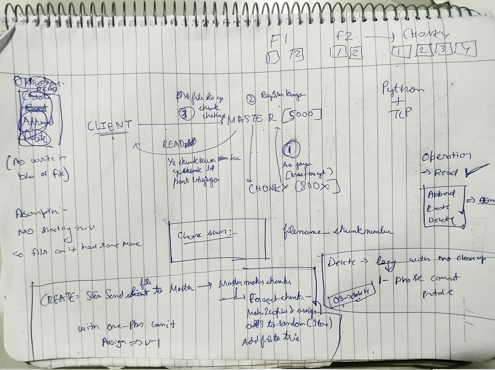

# GFS-Append

### Planing Day-1

### Chunkserver Progress
- Made class for Chunk
- Made Chunk Directory to store metadata 
- Made a common message structure that works with JSON
- Completed handling of connections
- Completed once append for chunkserver

### BUGs 🐛
-  

| CREATE          | Description           | Status   |
|------------------|-----------------------|----------|
| CREATE    | when we create next chunk_no is not start with 1 it start with what left| Resolved |
| Overall  | when chunks reguister they are not sending data properly means i was unable to delete the data present from earlier session | Pending  |
